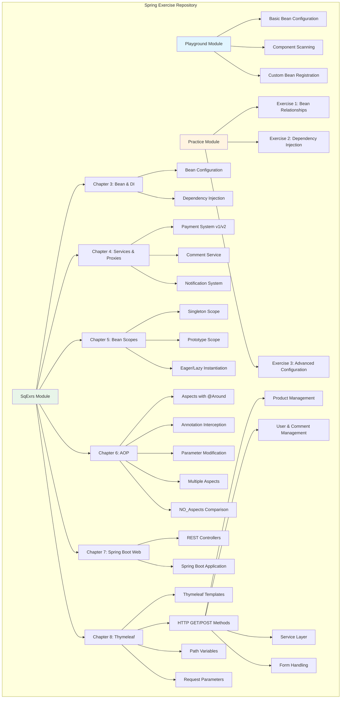
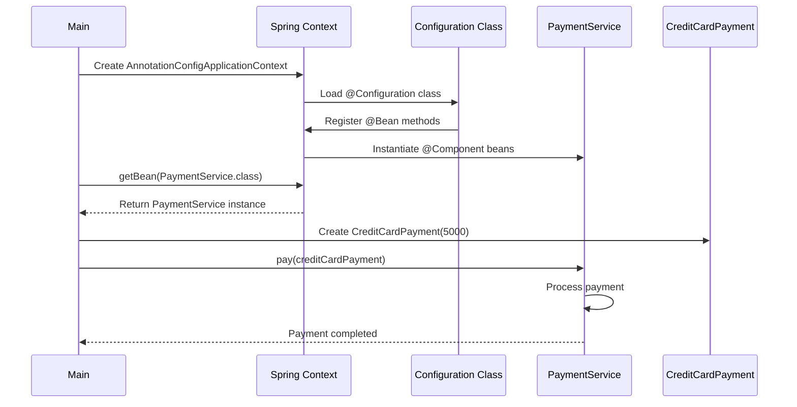
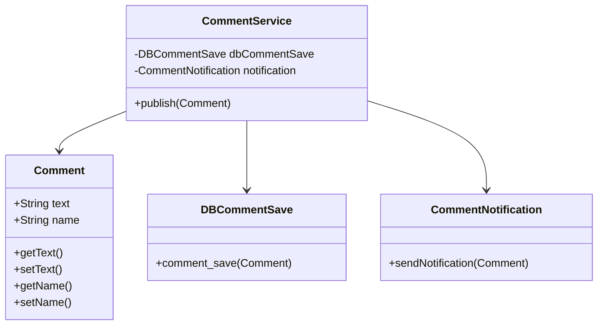

<div align="center">

# Spring Exercise Repository


```
    ╔═══════════════════════════════════════════════════════╗
    ║                                                       ║
    ║     ____                    ____  __           __    ║
    ║    / __/__  ___  ___  ___  / __ \/ /___  _____/ /    ║
    ║   / /_/ _ \/ _ \/ _ \/ -_) / /_/ / / __ \/ ___/ __   ║
    ║  / __/\___/_//_/\___/\__/ / .___/_/\___/\__/\__/    ║
    ║ /_/                       /_/                        ║
    ║                                                       ║
    ║         Learning Spring Framework                    ║
    ║                                                       ║
    ╚═══════════════════════════════════════════════════════╝
```

**A comprehensive Spring Framework learning repository with hands-on exercises covering core concepts from bean configuration to advanced dependency injection patterns.**

  

```
From Beans to AOP → Progressive Learning Path
```

[](https://www.oracle.com/java/)
[](https://spring.io/projects/spring-boot)
[](https://maven.apache.org/)
[](LICENSE)

[](https://github.com/UsmanovMahmudkhan/spring-start-here)
[](https://github.com/UsmanovMahmudkhan/spring-start-here)


</div>

---

## Architecture

### System Overview



### Runtime Flow (Example: Payment System)



### Data Model (Example: Comment System)



---

## Repository Structure

```
springExercise/
├── src/
│   ├── main/
│   │   ├── java/spring/springExercise/
│   │   │   ├── SpringExerciseApplication.java    # Main Spring Boot application
│   │   │   ├── Playground/                        # Basic Spring concepts
│   │   │   │   ├── Bean/                          # Bean classes (Car, Parrot, etc.)
│   │   │   │   ├── Config/                        # Configuration classes
│   │   │   │   └── Main/                          # Entry points for playground examples
│   │   │   ├── Practice/                          # Practice exercises
│   │   │   │   ├── Bean/                          # Exercise bean classes
│   │   │   │   ├── Config/                        # Exercise configurations
│   │   │   │   └── Main/                          # Exercise entry points (Ex1Main, Ex2Main, Ex3Main)
│   │   │   └── SqExrs/                            # Structured exercises
│   │   │       ├── Chapter3/                      # Bean configuration & dependency injection
│   │   │       │   ├── Bean/                       # Parrot, Person beans
│   │   │       │   ├── Configuration/              # Config classes (Config, Config2, Config3, etc.)
│   │   │       │   └── Main.java                   # Chapter 3 entry point
│   │   │       ├── Chapter4/                       # Services, repositories, proxies
│   │   │       │   ├── Model/                      # Comment model
│   │   │       │   ├── PaymentSystem/              # Payment examples (v1, v2)
│   │   │       │   ├── NotificationBasic/         # Notification examples (v1, v2)
│   │   │       │   ├── Service/                    # Service layer
│   │   │       │   ├── Repository/                 # Repository layer
│   │   │       │   └── Proxy/                      # Proxy pattern examples
│   │   │       ├── Chapter5/                       # Bean scopes
│   │   │           ├── Singleton/                  # Singleton scope examples
│   │   │           ├── Protorype/                  # Prototype scope examples
│   │   │           ├── Eager_Instantiation/        # Eager loading examples
│   │   │           └── Lazy_Instantiation/         # Lazy loading examples
│   │   │       ├── Chapter6/                       # Aspect-Oriented Programming (AOP)
│   │   │           ├── Aspects/                    # AOP examples with @Aspect
│   │   │           ├── AnnotationInterceptedMethods/  # AOP with custom annotations
│   │   │           ├── InterceptedMethodParameter/     # Modifying method parameters
│   │   │           ├── TwoAspectsInOneMethod/          # Multiple aspects ordering
│   │   │           └── NO_Aspects/                 # Comparison without AOP
│   │   │       ├── Chapter7/                       # Spring Boot Web (REST)
│   │   │           ├── Application.java            # Spring Boot application
│   │   │           └── HelloController.java        # REST controller example
│   │   │       └── Chapter8/                       # Thymeleaf Templates
│   │   │           ├── Application.java            # Spring Boot application
│   │   │           ├── Controller.java             # MVC controller with templates
│   │   │           ├── Comment.java                # Comment model
│   │   │           ├── HttpMethod/                 # HTTP method examples
│   │   │           │   ├── HttpsMethods/            # Product management (GET/POST)
│   │   │           │   │   ├── Application.java    # Standalone Spring Boot app
│   │   │           │   │   ├── Controller/         # Product controller
│   │   │           │   │   ├── Service/            # ProductService
│   │   │           │   │   ├── Model/              # Products model
│   │   │           │   │   └── Configuration/      # Config class
│   │   │           │   └── HttpsMethods2/          # User & Comment management
│   │   │           │       ├── Application.java    # Standalone Spring Boot app
│   │   │           │       ├── Controller/         # User/Comment controller
│   │   │           │       ├── Service/            # UserService
│   │   │           │       ├── Model/              # User, Comment models
│   │   │           │       └── Configuration/      # Config class
│   │   │           ├── PathVariable/               # Path variable examples
│   │   │           │   ├── Application.java        # Standalone Spring Boot app
│   │   │           │   └── Controller.java         # Path variable controller
│   │   │           └── RequestParametr/            # Request parameter examples
│   │   │               ├── Application.java        # Standalone Spring Boot app
│   │   │               └── Controller.java         # Request parameter controller
│   │   └── resources/
│   │       ├── templates/                          # Thymeleaf templates
│   │       │   ├── home.html                       # Home page template
│   │       │   ├── main.html                       # Main page template
│   │       │   ├── color.html                      # Color example template (PathVariable)
│   │       │   ├── name.html                       # Name example template (RequestParam)
│   │       │   ├── names.html                      # User name template (HttpsMethods2)
│   │       │   ├── allproducts.html                # Products list template (HttpsMethods)
│   │       │   └── userComment.html                # User & Comment template (HttpsMethods2)
│   │       └── application.properties              # Spring Boot configuration
│   └── test/
│       └── java/spring/springExercise/
│           └── SpringExerciseApplicationTests.java # Basic test class
├── pom.xml                                         # Maven project configuration
├── mvnw                                            # Maven wrapper (Unix)
├── mvnw.cmd                                        # Maven wrapper (Windows)
└── LICENSE                                         # Boost Software License 1.0
```

### Key Folders Explained

- **Playground/**: Introduction to Spring concepts with simple, isolated examples
- **Practice/**: Hands-on exercises to reinforce learning (Ex1, Ex2, Ex3)
- **SqExrs/Chapter3/**: Bean configuration methods and dependency injection patterns
- **SqExrs/Chapter4/**: Real-world patterns including payment systems, comment services, and notification systems with multiple implementation versions
- **SqExrs/Chapter5/**: Bean scope management (Singleton, Prototype) and instantiation strategies (Eager, Lazy)
- **SqExrs/Chapter6/**: Aspect-Oriented Programming (AOP) with `@Aspect`, `@Around` annotations, annotation-based interception, parameter modification, multiple aspects ordering, and comparison examples
- **SqExrs/Chapter7/**: Spring Boot web applications with REST controllers (`@RestController`, `@GetMapping`)
- **SqExrs/Chapter8/**: Thymeleaf server-side templating with Spring MVC, including:
  - **Main Controller**: Basic Thymeleaf integration with model attributes
  - **HttpMethod/HttpsMethods**: Complete CRUD example with `@GetMapping` and `@PostMapping`, `ProductService`, and product management
  - **HttpMethod/HttpsMethods2**: User and Comment management system with `UserService`, nested model access (`user.comment.text`), and path variable lookup
  - **PathVariable**: Path variable examples with `@PathVariable` annotation
  - **RequestParametr**: Request parameter examples with `@RequestParam` (including optional parameters)

---
