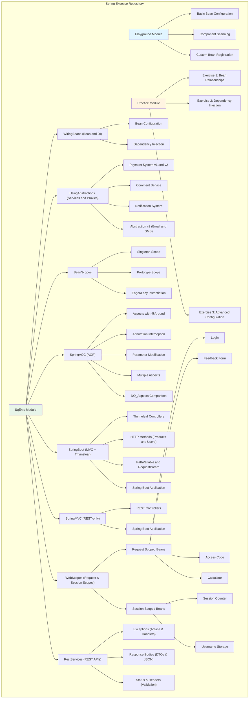
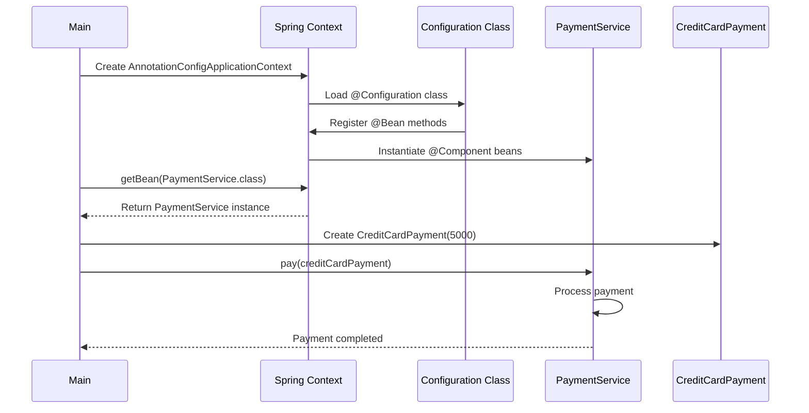
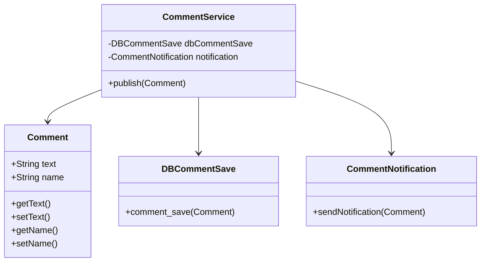

## Architecture



### Runtime Flow (Example: Payment System)



### Data Model (Example: Comment System)



---

## Repository Structure

```
springExercise/
├── src/
│   ├── main/
│   │   ├── java/spring/springExercise/
│   │   │   ├── SpringExerciseApplication.java    # Main Spring Boot application
│   │   │   ├── Playground/                        # Basic Spring concepts
│   │   │   │   ├── Bean/                          # Bean classes (Car, Parrot, Comment, etc.)
│   │   │   │   ├── Config/                        # Configuration classes
│   │   │   │   └── Main/                          # Entry points for playground examples (Main, Main2)
│   │   │   ├── Practice/                          # Practice exercises
│   │   │   │   ├── Bean/                          # Exercise bean classes
│   │   │   │   ├── Config/                        # Exercise configurations
│   │   │   │   └── Main/                          # Exercise entry points (Ex1Main, Ex2Main, Ex3Main)
│   │   │   └── SqExrs/                            # Structured exercises (Chapters 3–9 reorganized into named modules)
│   │   │       ├── WiringBeans/                   # Former Chapter 3: bean configuration & dependency injection
│   │   │       │   ├── Bean/                      # Parrot, Person beans
│   │   │       │   ├── Configuration/             # Config classes (Config, Config2, Config3, etc.)
│   │   │       │   └── Main*.java                 # Entry points (Main, Main2, Main4)
│   │   │       ├── UsingAbstractions/             # Former Chapter 4: services, repositories, proxies
│   │   │       │   ├── Model/                     # Comment model and entry-point Main
│   │   │       │   ├── PaymentSystem/             # Payment examples (v1, v2)
│   │   │       │   ├── NotificationBasic/         # Notification examples (v1, v2)
│   │   │       │   ├── Service/                   # Service layer
│   │   │       │   ├── Repository/                # Repository layer
│   │   │       │   ├── Proxy/                     # Proxy pattern examples
│   │   │       │   └── v2/                        # Alternative abstraction-based implementation (email/SMS)
│   │   │       ├── BeanScopes/                    # Former Chapter 5: bean scopes
│   │   │       │   ├── Singleton/                 # Singleton scope examples
│   │   │       │   ├── Protorype/                 # Prototype scope examples
│   │   │       │   ├── Eager_Instantiation/       # Eager loading examples
│   │   │       │   ├── Lazy_Instantiation/        # Lazy loading examples
│   │   │       │   ├── Config*.java               # Scope configuration classes
│   │   │       │   └── Main*.java                 # Scope demonstration entry points
│   │   │       ├── SpringAOC/                     # Former Chapter 6: Aspect-Oriented Programming (AOP)
│   │   │       │   ├── Aspects/                   # AOP examples with @Aspect
│   │   │       │   ├── AnnotationInterceptedMethods/  # AOP with custom annotations
│   │   │       │   ├── InterceptedMethodParameter/    # Modifying method parameters
│   │   │       │   ├── TwoAspectsInOneMethod/         # Multiple aspects ordering
│   │   │       │   └── NO_Aspects/                # Comparison without AOP
│   │   │       ├── SpringBoot/                    # Former Chapters 7 & 8: Spring Boot + Thymeleaf
│   │   │       │   ├── Application.java           # Spring Boot application
│   │   │       │   ├── Controller.java            # MVC controller with templates
│   │   │       │   ├── Comment.java               # Comment model
│   │   │       │   ├── HttpMethod/                # HTTP method examples
│   │   │       │   │   ├── HttpsMethods/          # Product management (GET/POST)
│   │   │       │   │   │   ├── Application.java   # Standalone Spring Boot app
│   │   │       │   │   │   ├── Controller/        # Product controller
│   │   │       │   │   │   ├── Service/           # ProductService
│   │   │       │   │   │   ├── Model/             # Products model
│   │   │       │   │   │   └── Configuration/     # Config class
│   │   │       │   │   └── HttpsMethods2/         # User & Comment management
│   │   │       │   │       ├── Application.java   # Standalone Spring Boot app
│   │   │       │   │       ├── Controller/        # User/Comment controller
│   │   │       │   │       ├── Service/           # UserService
│   │   │       │   │       ├── Model/             # User, Comment models
│   │   │       │   │       └── Configuration/     # Config class
│   │   │       │   ├── PathVariable/              # Path variable examples
│   │   │       │   │   ├── Application.java       # Standalone Spring Boot app
│   │   │       │   │   └── Controller.java        # Path variable controller
│   │   │       │   └── RequestParametr/           # Request parameter examples
│   │   │       │       ├── Application.java       # Standalone Spring Boot app
│   │   │       │       └── Controller.java        # Request parameter controller
│   │   │       ├── SpringMVC/                     # REST-style controller without templates
│   │   │       │   ├── Application.java           # Spring Boot application
│   │   │       │   └── HelloController.java       # REST controller example
│   │   │       └── WebScopes/                     # Former Chapter 9: web request/session scopes
│   │   │           ├── RequestScopedBean/         # Request-scoped bean examples
│   │   │           │   ├── AccessCodeValidation/  # Access code validation
│   │   │           │   │   ├── AccessCode.java
│   │   │           │   │   ├── AccessCodeService.java
│   │   │           │   │   ├── App.java
│   │   │           │   │   ├── Config.java
│   │   │           │   │   └── Controller.java
│   │   │           │   ├── Calculator/            # Calculator example
│   │   │           │   │   ├── Application.java
│   │   │           │   │   ├── CalculatorController.java
│   │   │           │   │   ├── CalculatorRequest.java
│   │   │           │   │   ├── CalculatorService.java
│   │   │           │   │   └── Config.java
│   │   │           │   ├── FeedbackForm/          # Feedback form example
│   │   │           │   │   ├── Configuration/     # Config.java
│   │   │           │   │   ├── Controller/        # FormController.java
│   │   │           │   │   ├── Model/             # Form.java
│   │   │           │   │   └── Service/           # FormService.java
│   │   │           │   └── Login/                 # Login example
│   │   │           │       ├── Main.java          # Entry point
│   │   │           │       ├── Config.java        # Configuration class
│   │   │           │       ├── Controller.java    # Login controller (GET/POST)
│   │   │           │       └── LoginProcessor.java# Request-scoped login bean
│   │   │           └── SessionScopedBean/         # Session-scoped bean examples
│   │   │               ├── SessionCounter/        # Session counter example
│   │   │               │   ├── App.java
│   │   │               │   ├── Config.java
│   │   │               │   ├── Controller.java
│   │   │               │   ├── Counter.java
│   │   │               │   └── CounterService.java
│   │   │               └── UsernameStorage/       # Username storage example
│   │   │                   ├── App.java
│   │   │                   ├── Configuration.java
│   │   │                   ├── UserController.java
│   │   │                   ├── Username.java
│   │   │                   └── UserNameService.java
│   │   │       ├── RestServices/                  # REST Services (Exceptions, Response Bodies, Status)
│   │   │       │   ├── Exceptions/                # REST Exception Handling
│   │   │       │   │   ├── App.java
│   │   │       │   │   ├── Config.java
│   │   │       │   │   ├── RestController.java
│   │   │       │   │   ├── RestControllerAdvice.java  # @RestControllerAdvice example
│   │   │       │   │   └── Payment2/              # Payment exception example
│   │   │       │   ├── SendingObjects_AsResponseBody/ # Return values as Response Body
│   │   │       │   │   ├── Client/                # Client example
│   │   │       │   │   ├── Country/               # Country example
│   │   │       │   │   └── DTOasJSON/             # Returning DTOs as JSON
│   │   │       │   │       ├── App.java
│   │   │       │   │       ├── Config/
│   │   │       │   │       ├── DTO/
│   │   │       │   │       └── RestController/
│   │   │       │   └── StatusAndHeaders/          # Status codes and Response Headers
│   │   │       │       ├── CustomStatus/          # Custom HTTP status
│   │   │       │       ├── User/                  # User management
│   │   │       │       └── ValidationOutcome/     # Validation examples
│   │   └── resources/
│   │       ├── templates/                          # Thymeleaf templates
│   │       │   ├── Math.html                       # Calculator template
│   │       │   ├── access.html                     # Access code template
│   │       │   ├── allproducts.html                # Products list template (HttpsMethods)
│   │       │   ├── color.html                      # Color example template (PathVariable)
│   │       │   ├── counter.html                    # Session counter template
│   │       │   ├── form.html                       # Feedback form template
│   │       │   ├── formResult.html                 # Feedback result template
│   │       │   ├── home.html                       # Home page template
│   │       │   ├── login.html                      # Login page template (Chapter 9 RequestScopedBean)
│   │       │   ├── main.html                       # Main page template
│   │       │   ├── name.html                       # Name example template (RequestParam)
│   │       │   ├── names.html                      # User name template (HttpsMethods2)
│   │       │   ├── readName.html
│   │       │   ├── show.html
│   │       │   ├── userComment.html                # User & Comment template (HttpsMethods2)
│   │       │   └── username.html                   # Username storage template
│   │       └── application.properties              # Spring Boot configuration
│   └── test/
│       └── java/spring/springExercise/
│           ├── SpringExerciseApplicationTests.java # Basic test class
│           └── SqExrs/                            # Exercise tests
│               ├── Chapter7/                      # Chapter 7 tests
│               └── SpringMVC/                     # Spring MVC tests
├── pom.xml                                         # Maven project configuration
├── mvnw                                            # Maven wrapper (Unix)
├── mvnw.cmd                                        # Maven wrapper (Windows)
└── LICENSE                                         # Boost Software License 1.0
```

