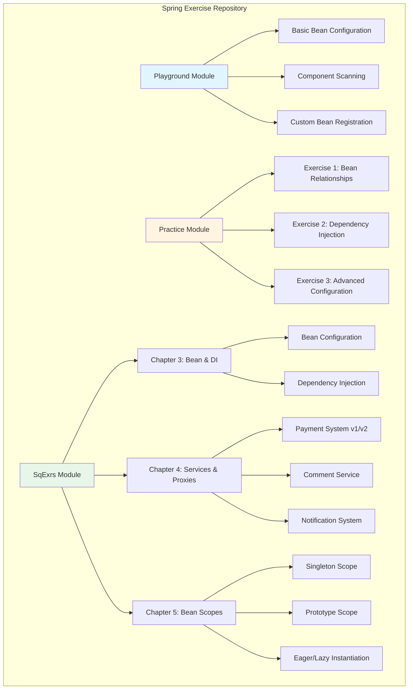

# Spring Exercise Repository

**A comprehensive Spring Framework learning repository with hands-on exercises covering core concepts from bean configuration to advanced dependency injection patterns.**

[](https://www.oracle.com/java/)
[](https://spring.io/projects/spring-boot)
[](https://maven.apache.org/)
[](LICENSE)

---

## Table of Contents

- [Overview](#overview)
- [Architecture](#architecture)
- [Tech Stack](#tech-stack)
- [Repository Structure](#repository-structure)
- [Getting Started](#getting-started)
- [Usage](#usage)
- [Testing](#testing)
- [Linting / Formatting](#linting--formatting)
- [Troubleshooting](#troubleshooting)
- [Security](#security)
- [Contributing](#contributing)
- [Roadmap](#roadmap)
- [License](#license)
- [Credits / Acknowledgements](#credits--acknowledgements)

---

## Overview

This repository serves as a comprehensive learning resource for Spring Framework fundamentals. It contains progressive exercises organized into three main sections: **Playground** (basic concepts), **Practice** (hands-on exercises), and **SqExrs** (structured chapter-based exercises).

### What It Does

- Demonstrates Spring Framework core concepts through practical, runnable examples
- Provides progressive learning path from basic bean configuration to advanced patterns
- Includes multiple implementations of the same concepts for comparison and learning
- Covers dependency injection, component scanning, bean scopes, and proxy patterns

### Who It's For

- **Students** learning Spring Framework fundamentals
- **Developers** transitioning to Spring from other frameworks
- **Educators** teaching Spring concepts with practical examples
- **Contributors** looking to practice Spring patterns

### Key Features

- **Progressive Learning Path**: Exercises organized from basic to advanced concepts
- **Multiple Implementations**: Different approaches to the same problem (v1, v2 patterns)
- **Standalone Examples**: Each exercise can be run independently
- **Real-World Patterns**: Payment systems, comment services, notification systems
- **Bean Scope Demonstrations**: Singleton, Prototype, Eager, and Lazy instantiation
- **Dependency Injection Examples**: Constructor, setter, and field injection
- **Component Scanning**: Annotation-based and configuration-based approaches

---

## Architecture

### High-Level Overview

This repository follows a modular structure where each module demonstrates specific Spring concepts. The architecture is designed for learning, with each exercise being self-contained and runnable.

### System Overview



### Runtime Flow (Example: Payment System)


### Data Model (Example: Comment System)


---

## Tech Stack

| Technology | Version | Purpose |
|------------|---------|---------|
| **Java** | 21 | Programming language |
| **Spring Boot** | 4.0.0 | Application framework |
| **Spring Context** | 6.2.7 | Dependency injection container |
| **Maven** | 3.6+ | Build tool and dependency management |
| **JUnit** | (via Spring Boot Starter Test) | Testing framework |
| **javax.annotation-api** | 1.3.2 | Annotation support |

---

## Repository Structure

```
springExercise/
├── src/
│   ├── main/
│   │   ├── java/spring/springExercise/
│   │   │   ├── SpringExerciseApplication.java    # Main Spring Boot application
│   │   │   ├── Playground/                        # Basic Spring concepts
│   │   │   │   ├── Bean/                          # Bean classes (Car, Parrot, etc.)
│   │   │   │   ├── Config/                        # Configuration classes
│   │   │   │   └── Main/                          # Entry points for playground examples
│   │   │   ├── Practice/                          # Practice exercises
│   │   │   │   ├── Bean/                          # Exercise bean classes
│   │   │   │   ├── Config/                        # Exercise configurations
│   │   │   │   └── Main/                          # Exercise entry points (Ex1Main, Ex2Main, Ex3Main)
│   │   │   └── SqExrs/                            # Structured exercises
│   │   │       ├── Chapter3/                      # Bean configuration & dependency injection
│   │   │       │   ├── Bean/                       # Parrot, Person beans
│   │   │       │   ├── Configuration/              # Config classes (Config, Config2, Config3, etc.)
│   │   │       │   └── Main.java                   # Chapter 3 entry point
│   │   │       ├── Chapter4/                       # Services, repositories, proxies
│   │   │       │   ├── Model/                      # Comment model
│   │   │       │   ├── PaymentSystem/              # Payment examples (v1, v2)
│   │   │       │   ├── NotificationBasic/         # Notification examples (v1, v2)
│   │   │       │   ├── Service/                    # Service layer
│   │   │       │   ├── Repository/                 # Repository layer
│   │   │       │   └── Proxy/                      # Proxy pattern examples
│   │   │       └── Chapter5/                       # Bean scopes
│   │   │           ├── Singleton/                  # Singleton scope examples
│   │   │           ├── Protorype/                  # Prototype scope examples
│   │   │           ├── Eager_Instantiation/        # Eager loading examples
│   │   │           └── Lazy_Instantiation/         # Lazy loading examples
│   │   └── resources/
│   │       └── application.properties              # Spring Boot configuration
│   └── test/
│       └── java/spring/springExercise/
│           └── SpringExerciseApplicationTests.java # Basic test class
├── pom.xml                                         # Maven project configuration
├── mvnw                                            # Maven wrapper (Unix)
├── mvnw.cmd                                        # Maven wrapper (Windows)
└── LICENSE                                         # Boost Software License 1.0
```

### Key Folders Explained

- **Playground/**: Introduction to Spring concepts with simple, isolated examples
- **Practice/**: Hands-on exercises to reinforce learning (Ex1, Ex2, Ex3)
- **SqExrs/Chapter3/**: Bean configuration methods and dependency injection patterns
- **SqExrs/Chapter4/**: Real-world patterns including payment systems, comment services, and notification systems with multiple implementation versions
- **SqExrs/Chapter5/**: Bean scope management (Singleton, Prototype) and instantiation strategies (Eager, Lazy)

---

## Getting Started

### Quickstart

```bash
# 1. Clone the repository
git clone <repository-url>
cd springExercise

# 2. Verify Java version (requires Java 21)
java -version

# 3. Build the project
./mvnw clean install

# 4. Run a specific exercise (example: Playground)
./mvnw exec:java -Dexec.mainClass="spring.springExercise.Playground.Main.Main"

# 5. Or run the main Spring Boot application
./mvnw spring-boot:run
```

### Prerequisites

- **Java Development Kit (JDK)**: Version 21 or higher
  ```bash
  java -version  # Should show version 21 or higher
  ```
- **Maven**: Version 3.6+ (or use the included Maven Wrapper)
  ```bash
  ./mvnw --version  # Uses Maven Wrapper, no installation needed
  ```
- **IDE** (optional but recommended): IntelliJ IDEA, Eclipse, or VS Code with Java extensions

### Installation

1. **Clone the repository**:
   ```bash
   git clone <repository-url>
   cd springExercise
   ```

2. **Verify Java installation**:
   ```bash
   java -version
   # Should output: openjdk version "21" or higher
   ```

3. **Build the project**:
   ```bash
   # On Unix/macOS/Linux:
   ./mvnw clean install
   
   # On Windows:
   mvnw.cmd clean install
   ```

4. **Verify installation**:
   ```bash
   ./mvnw test
   ```

### Configuration

#### Application Properties

The project uses minimal configuration. The main configuration file is located at:

```
src/main/resources/application.properties
```

**Current Configuration**:
```properties
spring.application.name=springExercise
```

#### Environment Variables

No environment variables are required for basic execution. All examples are self-contained and use in-memory configurations.

#### Assumptions

- **No external dependencies**: All examples use Spring's built-in features and do not require databases, message queues, or external services
- **Standalone execution**: Each `Main.java` class can be run independently
- **In-memory operations**: No persistent storage is used; all data exists only during runtime
- **No authentication**: Examples do not implement security or authentication mechanisms

---

## Usage

### Running Individual Exercises

Each module contains standalone `Main.java` classes that can be executed independently.

#### Playground Examples

```bash
# Run the main playground example
./mvnw exec:java -Dexec.mainClass="spring.springExercise.Playground.Main.Main"
```

**What it demonstrates**:
- Bean retrieval by name and type
- Multiple beans of the same type
- Component scanning
- Custom bean registration at runtime

#### Practice Exercises

```bash
# Exercise 1: Bean relationships
./mvnw exec:java -Dexec.mainClass="spring.springExercise.Practice.Main.Ex1Main"

# Exercise 2: Advanced dependency injection
./mvnw exec:java -Dexec.mainClass="spring.springExercise.Practice.Main.Ex2Main"

# Exercise 3: Complex configurations
./mvnw exec:java -Dexec.mainClass="spring.springExercise.Practice.Main.Ex3Main"
```

#### Chapter-Based Exercises

**Chapter 3: Bean Configuration & Dependency Injection**
```bash
./mvnw exec:java -Dexec.mainClass="spring.springExercise.SqExrs.Chapter3.Main"
```

**Chapter 4: Payment System (v1)**
```bash
./mvnw exec:java -Dexec.mainClass="spring.springExercise.SqExrs.Chapter4.PaymentSystem.v1.Main"
```

**Chapter 4: Payment System (v2)**
```bash
./mvnw exec:java -Dexec.mainClass="spring.springExercise.SqExrs.Chapter4.PaymentSystem.v2.Main"
```

**Chapter 5: Bean Scopes**
```bash
# Singleton scope
./mvnw exec:java -Dexec.mainClass="spring.springExercise.SqExrs.Chapter5.Singleton.Main"

# Prototype scope
./mvnw exec:java -Dexec.mainClass="spring.springExercise.SqExrs.Chapter5.Protorype.Main"

# Eager instantiation
./mvnw exec:java -Dexec.mainClass="spring.springExercise.SqExrs.Chapter5.Eager_Instantiation.Main"

# Lazy instantiation
./mvnw exec:java -Dexec.mainClass="spring.springExercise.SqExrs.Chapter5.Lazy_Instantiation.Main"
```

### Running from IDE

1. **Import the project** into your IDE (IntelliJ IDEA, Eclipse, etc.)
2. **Navigate** to any `Main.java` file in the desired module
3. **Right-click** and select "Run" or use the IDE's run button
4. **View output** in the console to see the exercise results

### Example: Payment System Execution

```java
// File: SqExrs/Chapter4/PaymentSystem/v1/Main.java
public class Main {
    public static void main(String[] args) {
        var container = new AnnotationConfigApplicationContext(Config.class);
        var credit = new CreditCardPayment(5000);
        var payment = container.getBean(PaymentService.class);
        payment.pay(credit);
    }
}
```

**Expected Output**:
```
Done payment5000
```

### Feature Matrix

| Module | Bean Config | DI | Component Scan | Scopes | Proxies | Services |
|--------|------------|----|----------------|--------|---------|----------|
| **Playground** | ✅ | ✅ | ✅ | ❌ | ❌ | ❌ |
| **Practice** | ✅ | ✅ | ✅ | ❌ | ❌ | ❌ |
| **Chapter 3** | ✅ | ✅ | ✅ | ❌ | ❌ | ❌ |
| **Chapter 4** | ✅ | ✅ | ✅ | ❌ | ✅ | ✅ |
| **Chapter 5** | ✅ | ✅ | ✅ | ✅ | ❌ | ❌ |

---

## Testing

### Running Tests

```bash
# Run all tests
./mvnw test

# Run tests with verbose output
./mvnw test -X

# Run a specific test class
./mvnw test -Dtest=SpringExerciseApplicationTests
```

### Test Structure

The project includes a basic test class:

```
src/test/java/spring/springExercise/SpringExerciseApplicationTests.java
```

### Writing New Tests

To add tests for specific exercises:

1. Create a test class in `src/test/java/spring/springExercise/`
2. Use `@SpringBootTest` for integration tests
3. Use `@Test` for unit tests
4. Example structure:
   ```java
   @SpringBootTest
   class PlaygroundTest {
       @Test
       void testBeanRetrieval() {
           // Test implementation
       }
   }
   ```

---

## Linting / Formatting

### Code Style

This project follows standard Java conventions. While no specific linter configuration is included, consider:

- **Checkstyle**: For code style enforcement
- **SpotBugs**: For bug pattern detection
- **PMD**: For code quality analysis

### IDE Formatting

**IntelliJ IDEA**:
- Use default Java code style
- Enable "Reformat on Save" in Settings → Editor → Code Style

**Eclipse**:
- Use default Java formatter
- Enable "Format on Save" in Preferences → Java → Editor → Save Actions

**VS Code**:
- Install "Language Support for Java" extension
- Configure formatting in `.vscode/settings.json`

### Manual Formatting

```bash
# Format code using Maven (if formatter plugin is added)
./mvnw formatter:format
```

---

## Deployment

### Local Development

This is a learning repository designed for local execution. No deployment configuration is included.

### Production Considerations

If you plan to deploy exercises as a service:

1. **Add Spring Boot Actuator** for health checks:
   ```xml
   <dependency>
       <groupId>org.springframework.boot</groupId>
       <artifactId>spring-boot-starter-actuator</artifactId>
   </dependency>
   ```

2. **Configure application properties** for production:
   ```properties
   spring.profiles.active=prod
   server.port=8080
   ```

3. **Build executable JAR**:
   ```bash
   ./mvnw clean package
   java -jar target/springExercise-0.0.1-SNAPSHOT.jar
   ```

### CI/CD

No CI/CD workflows are currently configured. To add GitHub Actions:

1. Create `.github/workflows/ci.yml`
2. Configure Maven build and test steps
3. Add Java 21 setup action

---

## Troubleshooting

### Common Issues

#### Issue: "Java version mismatch"

**Error**:
```
Unsupported class file major version XX
```

**Solution**:
- Ensure Java 21 is installed: `java -version`
- Set `JAVA_HOME` environment variable
- Update IDE project SDK to Java 21

#### Issue: "Maven wrapper not executable"

**Error**:
```
Permission denied: ./mvnw
```

**Solution**:
```bash
chmod +x mvnw
```

#### Issue: "Class not found"

**Error**:
```
java.lang.ClassNotFoundException
```

**Solution**:
- Rebuild the project: `./mvnw clean install`
- Verify the class path in your IDE
- Check that package names match directory structure

#### Issue: "Bean not found"

**Error**:
```
NoSuchBeanDefinitionException
```

**Solution**:
- Verify `@ComponentScan` includes the package
- Check `@Configuration` class is loaded
- Ensure `@Bean` method is properly annotated

#### Issue: "Spring Context not initializing"

**Error**:
```
ApplicationContextException
```

**Solution**:
- Verify all dependencies are resolved: `./mvnw dependency:tree`
- Check for circular dependencies
- Review configuration class annotations

### Getting Help

1. **Check existing issues** in the repository
2. **Review Spring documentation**: https://spring.io/docs
3. **Verify Java and Maven versions**
4. **Clean and rebuild**: `./mvnw clean install`

---

## Security

### Secrets Handling

This repository does not handle sensitive data. All examples use:
- In-memory data structures
- No database connections
- No external API keys
- No authentication mechanisms

### Best Practices for Future Development

If adding features that require security:

1. **Never commit secrets** to version control
2. **Use environment variables** for sensitive configuration
3. **Implement Spring Security** for authentication/authorization
4. **Validate input** in service layers
5. **Use HTTPS** for any network communication

### Reporting Vulnerabilities

If you discover a security vulnerability:

1. **Do not** open a public issue
2. Contact the repository maintainer privately
3. Provide detailed information about the vulnerability
4. Allow time for the issue to be addressed before public disclosure

---

## Contributing

We welcome contributions! This repository is designed for learning, so contributions that improve clarity, add examples, or fix issues are especially valuable.

### Development Setup

1. **Fork the repository**
2. **Clone your fork**:
   ```bash
   git clone <your-fork-url>
   cd springExercise
   ```

3. **Create a feature branch**:
   ```bash
   git checkout -b feature/your-feature-name
   ```

4. **Make your changes**:
   - Follow existing code style
   - Add comments for complex logic
   - Keep examples self-contained

5. **Test your changes**:
   ```bash
   ./mvnw clean test
   ```

6. **Commit your changes**:
   ```bash
   git commit -m "Add: Description of your changes"
   ```

7. **Push to your fork**:
   ```bash
   git push origin feature/your-feature-name
   ```

8. **Open a Pull Request** on GitHub

### Branching Strategy

- **main**: Stable, working code
- **feature/**: New exercises or features
- **fix/**: Bug fixes
- **docs/**: Documentation improvements

### Commit Conventions

Use clear, descriptive commit messages:

- `Add: New exercise for Chapter 4`
- `Fix: Bean scope issue in Singleton example`
- `Docs: Update README with new examples`
- `Refactor: Simplify PaymentService implementation`

### Pull Request Checklist

Before submitting a PR, ensure:

- [ ] Code compiles without errors
- [ ] All tests pass: `./mvnw test`
- [ ] Code follows existing style conventions
- [ ] Examples are self-contained and runnable
- [ ] README is updated if adding new modules
- [ ] Commit messages are clear and descriptive

### Code Review Process

1. Maintainers will review your PR
2. Address any feedback or requested changes
3. Once approved, your PR will be merged
4. Thank you for contributing! 🎉

---

## Roadmap

Based on the current repository structure, potential future enhancements:

### Short Term

- [ ] Add comprehensive unit tests for each exercise
- [ ] Create Chapter 6: AOP (Aspect-Oriented Programming)
- [ ] Add REST API examples with Spring Web
- [ ] Include database integration examples (JPA/Hibernate)
- [ ] Add Spring Security examples

### Medium Term

- [ ] Create interactive tutorials
- [ ] Add performance comparison examples
- [ ] Include Spring Boot Actuator examples
- [ ] Add Docker containerization examples
- [ ] Create CI/CD pipeline with GitHub Actions

### Long Term

- [ ] Web-based learning platform
- [ ] Video tutorials for each chapter
- [ ] Integration with Spring Cloud examples
- [ ] Microservices architecture examples
- [ ] Reactive programming with Spring WebFlux

### Contributing to Roadmap

Have ideas? Open an issue or submit a PR with your suggestions!

---

## License

This project is licensed under the **Boost Software License 1.0**.

```
Boost Software License - Version 1.0 - August 17th, 2003

Permission is hereby granted, free of charge, to any person or organization
obtaining a copy of the software and accompanying documentation covered by
this license (the "Software") to use, reproduce, display, distribute,
execute, and transmit the Software, and to prepare derivative works of the
Software, and to permit third-parties to whom the Software is furnished to
do so, all subject to the following:

The copyright notices in the Software and this entire statement, including
the above license grant, this restriction and the following disclaimer,
must be included in all copies of the Software, in whole or in part, and
all derivative works of the Software, unless such copies or derivative
works are solely in the form of machine-executable object code generated by
a source language processor.

THE SOFTWARE IS PROVIDED "AS IS", WITHOUT WARRANTY OF ANY KIND, EXPRESS OR
IMPLIED, INCLUDING BUT NOT LIMITED TO THE WARRANTIES OF MERCHANTABILITY,
FITNESS FOR A PARTICULAR PURPOSE, TITLE AND NON-INFRINGEMENT. IN NO EVENT
SHALL THE COPYRIGHT HOLDERS OR ANYONE DISTRIBUTING THE SOFTWARE BE LIABLE
FOR ANY DAMAGES OR OTHER LIABILITY, WHETHER IN CONTRACT, TORT OR OTHERWISE,
ARISING FROM, OUT OF OR IN CONNECTION WITH THE SOFTWARE OR THE USE OR OTHER
DEALINGS IN THE SOFTWARE.
```

See [LICENSE](LICENSE) file for full text.

---

## Credits / Acknowledgements

### Technologies & Frameworks

- **[Spring Framework](https://spring.io/)**: The foundation for all examples
- **[Spring Boot](https://spring.io/projects/spring-boot)**: Application framework
- **[Maven](https://maven.apache.org/)**: Build and dependency management
- **[Java](https://www.oracle.com/java/)**: Programming language

### Learning Resources

This repository is designed as a learning tool. Concepts demonstrated are based on:

- Spring Framework official documentation
- Spring Boot reference guides
- Best practices from the Spring community

### Contributors

Contributors are welcome! See the [Contributing](#contributing) section for details.

### Inspiration

This repository structure is inspired by progressive learning approaches, organizing exercises from basic concepts to advanced patterns.

---

## Additional Resources

### Official Documentation

- [Spring Framework Documentation](https://docs.spring.io/spring-framework/)
- [Spring Boot Reference Guide](https://docs.spring.io/spring-boot/docs/current/reference/html/)
- [Spring Context Documentation](https://docs.spring.io/spring-framework/docs/current/reference/html/core.html)

### Learning Path

1. **Start with Playground**: Understand basic bean configuration
2. **Move to Practice**: Reinforce concepts with exercises
3. **Progress through Chapters**: Follow the structured learning path
4. **Experiment**: Modify examples to see how changes affect behavior

### Getting Help

- Review code comments in each example
- Check Spring Framework documentation
- Explore Spring Boot guides
- Join Spring community forums

---

**Happy Learning! 🚀**

